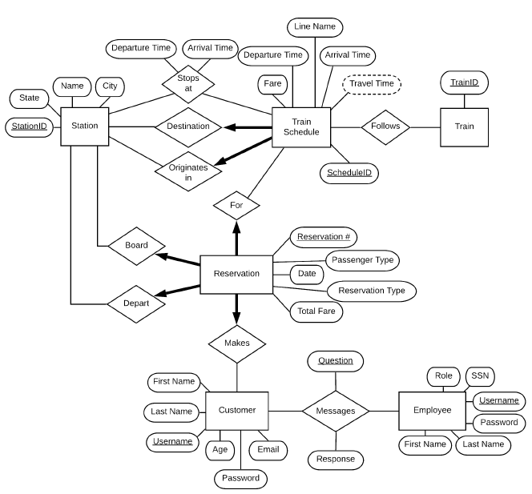

This was the project from CS335 Principles of Information and Data Management. The goal was to implement train reservation web application in Java.

## Specification
* Account functionality
    * Register, login, logout
* Browsing and search functionality
    * Search schedule by condition
    * sort by different criteria
* Reservations
    * Make resercation for a specific route
    * Get discount
    * Cancle reservation
    * View reservation history
* Admin functions
    * Manage information
    * Sales report per month
    * list of reservation by specific condition
    * list of renenue per line or customer
* Customer representative
    * edit train schedule
    * manage cumstomer's questions 

    <a href="https://github.com/Sangkyun-Kim15/Principles-of-Information-and-Data-Management" class="btn">Code</a>
    <a href="https://github.com/Sangkyun-Kim15/Principles-of-Information-and-Data-Management/blob/master/Project_Schema.sql" class="btn">schema</a>

