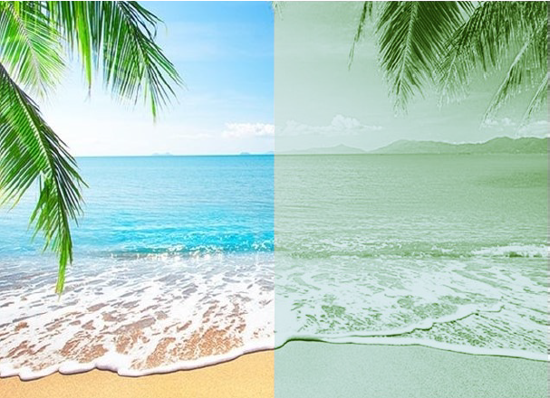

This was the project from CS440 Intro Artificial Intelligence. The goal was to convert grey scale image to two colorized version of image by using K mean clustering and neural networks.

## K mean clustering verion (Basic agent)
* Select 5 random pixel for grouping
* Grouping was based on the distance between the target pixcel and each centroid
* Using euclidean distance for calculate the distance.

## Neural Networks version (Advanced agent)
* A Feed-Forwarding 3 layers neural networks
* 9 nodes in the input layer (3x3 patch = 9 pixel)
* 5 nodes in the hidden layer
* 3 nodes in output layer (pixel has R, G, B)
* Using sigmoid function as activation function

    <a href="https://github.com/Norden-Tenzin/440ArtificialIntelligence/tree/master/COLORIZATION" class="btn">Code</a>
    <a href="https://github.com/Norden-Tenzin/440ArtificialIntelligence/blob/master/COLORIZATION/Report4_sk1998_tn266.pdf" class="btn">Tech Report</a>

