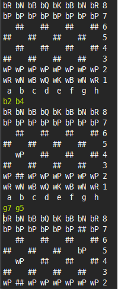

This was the project from CS213 Software Methodology. The goal was to implement a two-player, test-based chess game in Java by using OOP(Object oriented origram).

    <a href="https://github.com/Sangkyun-Kim15/Software-Methodology/tree/master/Chess" class="btn">Code</a>

