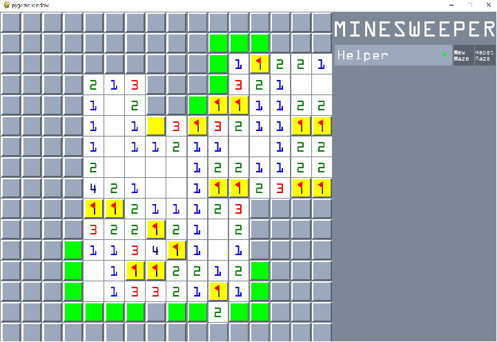

This was the project from CS440 Intro Artificial Intelligence. The goal was to creat a bot that can play minesweeper.

## Basic Agent
* The baisc agent cannot infer. It only plays the safest moves possible
* If no hidden cell can be idenrified as a mine or safe, it ramdoly pick a cell to reveal

## Advances Agent
* This bot was implented based on CSP(Constraint Satisfaction Problem)
* Creating constraints as a equation and add, remove, or update constraints in knowledge
* Infer next step based on this knowledge
* If no hidden cell can be idenrified as a mine or safe, it ramdoly pick a cell to reveal

## Bonus Advances Agent
* If no hidden cell can be idenrified as a mine or safe, it pick a cell to reveal based on probability
* Calculate all the possible scenarios based on the knowledge by using combination and product
* Compute the probability of each cell those in the equations in knowledge(number of cell showing up in the scenario / number of total scenario).

    <a href="https://github.com/Norden-Tenzin/440ArtificialIntelligence/tree/master/COLORIZATION" class="btn">Code</a>
    <a href="https://github.com/Norden-Tenzin/440ArtificialIntelligence/blob/master/COLORIZATION/Report4_sk1998_tn266.pdf" class="btn">Tech Report</a>

